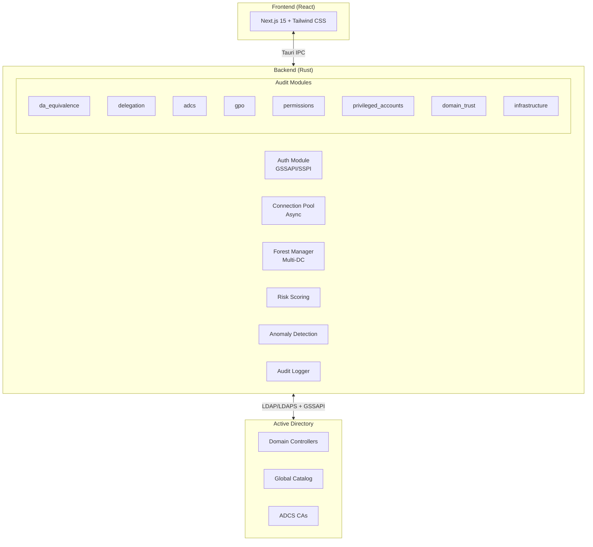

# ADSecurityAudit

A comprehensive Active Directory security auditing platform built with Rust and React. Performs deep security analysis across privilege escalation paths, Kerberos delegation, ADCS vulnerabilities, and infrastructure misconfigurations.

## Key Features

### Authentication
- **GSSAPI/Kerberos** - Windows integrated authentication using SSPI
- **Simple Bind** - Username/password with LDAPS support
- **Auto Mode** - Automatically selects best available method
- **Secure Credential Handling** - Zeroized memory, no plaintext storage

### Security Audits

| Audit Module | Coverage |
|--------------|----------|
| **DA Equivalence** | DCSync rights, Shadow Credentials, SID History, Ghost Accounts |
| **ADCS (ESC1-8)** | Certificate template abuse, enrollment agent, CA management |
| **Kerberos Delegation** | Unconstrained, Constrained, RBCD, Protocol Transition |
| **Privileged Accounts** | Tier 0/1/2 classification, AS-REP Roasting, Kerberoasting |
| **Domain Trusts** | SID filtering, selective auth, trust direction analysis |
| **GPO Security** | Dangerous permissions, unlinked GPOs, SYSVOL access |
| **Permissions** | AdminSDHolder, ACL analysis, dangerous delegations |
| **Infrastructure** | LDAP signing, SMB signing, NTLM restrictions, DCShadow |

### Attack Detection

<table>
<tr>
<td>

**Credential Theft**
- DCSync Rights
- LAPS Password Exposure
- gMSA Credential Access
- AS-REP Roasting

</td>
<td>

**Privilege Escalation**
- WriteSPN (Kerberoasting)
- Shadow Credentials
- RBCD Write Access
- Group Membership Control

</td>
</tr>
<tr>
<td>

**Persistence**
- Ghost Accounts
- SID History Abuse
- DCShadow Indicators

</td>
<td>

**Lateral Movement**
- Unconstrained Delegation
- Constrained to DCs
- Computer Object Control

</td>
</tr>
<tr>
<td>

**ADCS Attacks**
- ESC1: Enrollee Subject
- ESC2: Any Purpose EKU
- ESC3: Enrollment Agent
- ESC4: Template ACLs
- ESC7: CA Management
- ESC8: Web Enrollment

</td>
<td>

**Infrastructure**
- Weak Kerberos Encryption (RC4)
- Stale Computer Accounts
- NTLM Relay Exposure
- LDAP Signing Not Required
- SMB Signing Not Required

</td>
</tr>
</table>

### Risk Scoring & Analysis

- **Domain Risk Score** - Aggregate risk assessment (0-100)
- **User Risk Scoring** - Individual account risk factors
- **Anomaly Detection** - Behavioral baseline and deviation analysis
- **Compliance Reporting** - SOX, HIPAA, PCI-DSS, NIST mappings

## Architecture



## Installation

### Prerequisites

- **Rust 1.78+** - https://rustup.rs/
- **Node.js 18+** - https://nodejs.org/
- **Windows SDK** - For GSSAPI/SSPI support
- **Domain-joined machine** - For Kerberos authentication (optional)

### Build

```bash
# Clone repository
git clone https://github.com/yourusername/ADSecurityAudit-Rust.git
cd ADSecurityAudit-Rust

# Install frontend dependencies
npm install

# Development mode
npm run tauri:dev

# Production build
npm run tauri:build
```

The compiled binary will be in `src-tauri/target/release/`.

## Authentication

### GSSAPI/Kerberos (Recommended)

Uses the current Windows user's Kerberos ticket. No password required.

```rust
// Connection pool with GSSAPI
let pool = LdapConnectionPool::new_with_gssapi(
    "dc01.contoso.com".to_string(),
    "DC=contoso,DC=com".to_string(),
    None,
);
```

**Requirements:**
- Domain-joined Windows machine
- Valid Kerberos TGT (automatic from Windows logon)
- Network access to domain controller

### Simple Bind

Traditional username/password authentication. Use LDAPS (port 636) in production.

```rust
let pool = LdapConnectionPool::new(
    "dc01.contoso.com:636".to_string(),
    "svc_audit@contoso.com".to_string(),
    "password".to_string(),
    "DC=contoso,DC=com".to_string(),
    None,
);
```

### Auto Mode

Tries GSSAPI first, falls back to simple bind if credentials provided.

```rust
let pool = LdapConnectionPool::new_auto(
    "dc01.contoso.com".to_string(),
    Some("svc_audit@contoso.com".to_string()),
    Some("password".to_string()),
    "DC=contoso,DC=com".to_string(),
    None,
);
```

## Audit Modules

### DA Equivalence Audit

Finds accounts with Domain Admin equivalent privileges without being in DA group.

| Finding | Severity | Attack |
|---------|----------|--------|
| DCSync Rights | Critical | Extract all password hashes |
| Shadow Credentials | Critical | Passwordless authentication |
| SID History | High | Privilege through SID injection |
| Ghost Accounts | High | Stale privileged access |
| LAPS Read Access | High | Local admin credential theft |

### ADCS Vulnerabilities (ESC1-8)

Detects Active Directory Certificate Services misconfigurations.

| ESC | Vulnerability | Risk |
|-----|--------------|------|
| ESC1 | Enrollee supplies subject | Critical |
| ESC2 | Any Purpose / No EKU | High |
| ESC3 | Enrollment agent abuse | High |
| ESC4 | Vulnerable template ACLs | High |
| ESC5 | PKI object ACL abuse | High |
| ESC7 | CA management rights | Critical |
| ESC8 | NTLM relay to web enrollment | Critical |

### Infrastructure Security

| Check | What It Detects |
|-------|-----------------|
| Kerberos Encryption | Accounts using only RC4 (weak) |
| Stale Computers | Machines with old passwords (60/90/180 days) |
| DCShadow Indicators | Rogue DC SPNs on non-DC computers |
| LDAP Signing | Whether signing is enforced |
| SMB Signing | DC SMB signing configuration |
| NTLM Settings | LmCompatibilityLevel and restrictions |

### Delegation Audit

| Type | Risk | Detection |
|------|------|-----------|
| Unconstrained | Critical | TGT collection, credential theft |
| Constrained + T2A4D | Critical | Impersonation without creds |
| Constrained | High | Limited impersonation |
| RBCD | Medium | Requires write to target |

## Configuration

### Recommended Service Account Permissions

Minimum permissions for read-only auditing:
- Read all user/computer/group objects
- Read `userAccountControl`, `servicePrincipalName`
- Read `msDS-KeyCredentialLink`
- Read `nTSecurityDescriptor` (for ACL analysis)
- Read Certificate Templates (`CN=Configuration`)
- Read GPO objects and SYSVOL

### Environment Variables

```bash
# Optional: Override default timeouts
AD_CONNECT_TIMEOUT=30        # Connection timeout (seconds)
AD_OPERATION_TIMEOUT=120     # Query timeout (seconds)
AD_MAX_CONNECTIONS=10        # Connection pool size
```

## Output

### Risk Score Calculation

**Formula:** `Domain Risk Score = Sum of Finding Weights`

| Severity | Points |
|----------|--------|
| Critical | 25-50 |
| High | 15-25 |
| Medium | 8-15 |
| Low | 3-8 |

| Score Range | Risk Level |
|-------------|------------|
| 0-20 | Low Risk |
| 21-40 | Medium Risk |
| 41-70 | High Risk |
| 71-100 | Critical Risk |

### Export Formats

- **JSON** - Full structured data
- **PDF** - Executive summary reports
- **CSV** - Spreadsheet-compatible findings

## Security Considerations

### Credential Handling

- Credentials stored in zeroized memory (`zeroize` crate)
- GSSAPI eliminates password storage entirely
- No credentials written to disk or logs

### Network Security

| Mode | Encryption | Recommendation |
|------|------------|----------------|
| LDAP + GSSAPI | Kerberos encryption | Good |
| LDAPS | TLS 1.2+ | Good |
| LDAP + Simple | **None** | Avoid in production |

### Audit Logging

All operations logged with:
- Timestamp
- Principal (authenticated user)
- Operation type
- Target objects
- Result status

## Comparison with Other Tools

| Feature | ADSecurityAudit | PingCastle | Purple Knight |
|---------|-----------------|------------|---------------|
| Open Source | Yes | Partial | No |
| GSSAPI Auth | Yes | No | No |
| Real-time | Yes | No | No |
| ESC1-8 Detection | Yes | Yes | Yes |
| DCShadow Detection | Yes | No | Yes |
| Multi-Forest | Yes | Yes | Yes |
| Risk Scoring | Yes | Yes | Yes |
| Custom Rules | Planned | Limited | No |

## Project Structure

```
ADSecurityAudit-Rust/
├── src-tauri/src/              # Rust backend
│   ├── auth.rs                 # Authentication (GSSAPI/Simple)
│   ├── ad_client.rs            # Main AD client (~6000 lines)
│   ├── da_equivalence.rs       # DA equivalent detection
│   ├── delegation_audit.rs     # Kerberos delegation
│   ├── infrastructure_audit.rs # NTLM, Kerberos, DCShadow
│   ├── privileged_accounts.rs  # Tier classification
│   ├── domain_security.rs      # Password policy, features
│   ├── domain_trust_audit.rs   # Trust analysis
│   ├── gpo_audit.rs            # GPO security
│   ├── permissions_audit.rs    # ACL analysis
│   ├── group_audit.rs          # Group membership
│   ├── risk_scoring.rs         # Risk calculations
│   ├── anomaly_detection.rs    # Behavioral analysis
│   ├── audit_log.rs            # Compliance logging
│   ├── connection_pool.rs      # LDAP connection management
│   └── forest_manager.rs       # Multi-domain support
├── app/                        # Next.js frontend
├── components/                 # React components
└── lib/                        # TypeScript utilities
```

## Contributing

1. Fork the repository
2. Create a feature branch
3. Run tests: `cd src-tauri && cargo test`
4. Submit a pull request

## References

- [MITRE ATT&CK - Active Directory](https://attack.mitre.org/techniques/T1087/)
- [SpecterOps - Certified Pre-Owned](https://posts.specterops.io/certified-pre-owned-d95910965cd2)
- [Harmj0y - Kerberos Delegation](https://blog.harmj0y.net/activedirectory/s4u2pwnage/)
- [Microsoft - AD Security Best Practices](https://docs.microsoft.com/en-us/windows-server/identity/ad-ds/plan/security-best-practices/)

## License

MIT License - See [LICENSE](LICENSE) for details.

---

Built for security teams who need comprehensive AD visibility.
